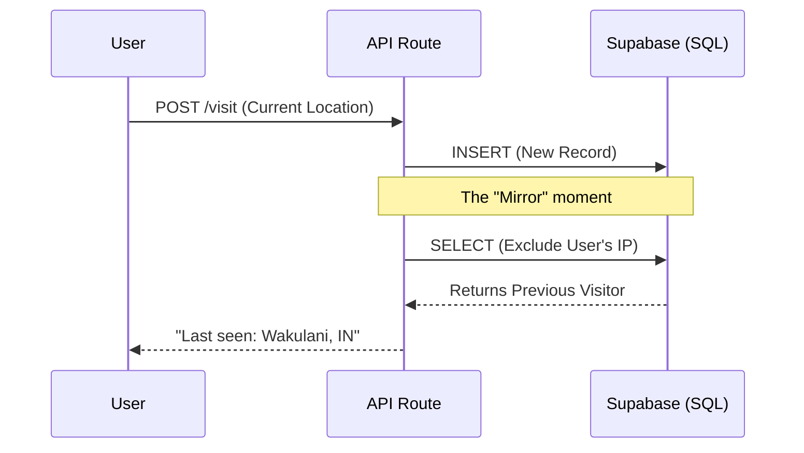
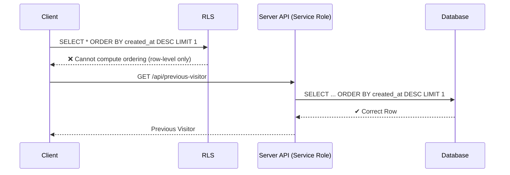

## The Quiet Company of Strangers on the Web

> “A developer’s homepage often feels like an empty hallway. I left the door open just enough to catch the visitor’s fleeting footprints.”

We often build for the "User"—that singular, abstract entity interacting with our interface in a vacuum. But the web is a crowded place. I wanted my footer to reflect that crowd, not with a creeping analytics dashboard, but with a gentle nod: “Someone from Mumbai was just here.”

Implementing this feature required dragging my frontend brain into the cold, hard logic of race conditions, RLS recursion, and the build-time hallucinations of a Next.js server. This is the story of how a simple "last seen" feature turned into a lesson on security boundaries and the careful choreography of data.


---

## Look Past Myself in a Database Query

Each visit—every refresh, every page load—is its own datapoint. So when I asked the database for the “last visitor,” it naturally returned the latest entry, which was almost always me. What I actually needed was the previous visitor: the last person before my current request.

To do that, I had to look one step past my own visit. The fix was simple: exclude the current IP when querying for the most recent entry.

```typescript
// The Corrected Query (Last-but-One Visitor)
.select('city, country')
.neq('ip', currentVisitorIP)   // Skip the current visit
.order('created_at', { ascending: false })
.limit(1)
```

Here, an IP address is just a stand-in for presence, not identity. It’s a blunt signal—often shared (NATs), obscured (VPNs), or shifting (dynamic IPs). But in an anonymous, privacy-first setup where I refuse to use cookies or local-storage tracking, it’s the only lightweight clue I allow myself.

I accept that fuzziness because it respects the visitor’s agency. The goal isn’t investigation or compulsive tracking; it’s simply to gesture toward a shared sense of human presence online—a quiet acknowledgment that someone from somewhere walked past this digital footprint before you did. Precision would undermine that intention, and it would come at the cost of privacy. That’s not a trade I’m interested in.

---
## The RLS Trap: When Security Eats Itself

I chose Supabase for persistence, but its Row Level Security (RLS) policies introduced a paradox when fetching the "last" record.

I attempted to define an RLS policy that limited anonymous users to view only the most recent records. The policy failed instantly.

**The Correction:** RLS policies evaluate access permissions *independently for each row*. They cannot reference **row ordering**, **aggregates**, or **result-wide logic** (like `LIMIT` or `ORDER BY`). A security policy cannot say "you can see the last two rows" because it cannot know which rows are the "last two" without first querying the entire, un-filtered set.

> The Golden Rule of RLS: Never write a policy that depends on the result of a query. Policies filter rows; they don't aggregate or sort them.

## The Fix: Relocating the Security Boundary

Because the query logic (`ORDER BY` + `LIMIT`) and required analytics (`COUNT(DISTINCT ip)` via a PostgreSQL Remote Procedure Call or **RPC**) are impossible to run safely under standard RLS, I had to move the logic. The debugging here was surprisingly frustrating. Gemini 3 Pro (High), Claude Sonnet 4.5 (Thinking), and even Opus 4.5 (Thinking) didn’t get me to the answer. In the end, it took a different GPT model outside my usual context setup to spark the lightbulb moment.



I relocated the previous visitor logic from the client-side Supabase client (which is governed by RLS) to a server-side API route using the **Service Role**. A shift moves the security boundary from the row level to the **endpoint level**.

---

## A Small Line of Text With a Long Shadow

It’s strange how a quiet little footer line can ripple through an entire system. When data, identity, and security meet, the work becomes a kind of choreography. Each part must know its place, respect its limits, and move without stepping on another.

Those subtle choices such as initializing late, looking past the current visitor, and relocating trust to the server are what preserve both system stability and the visitor’s privacy, while still keeping a sense of shared human presence.

Next, I hope to quietly count the number of eyes that pause on each post. A subtle echo of presence, not a trace of identity—just a gentle nod to those who walked this hallway before.